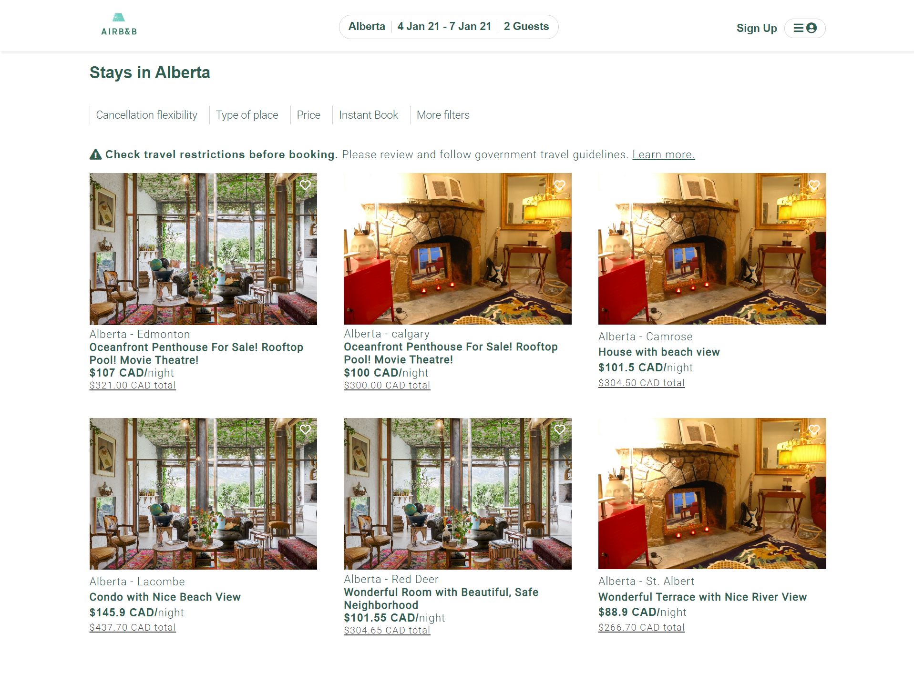

# Web Cloning
&nbsp;


A replica of Airbnb Website that provides a platform for both hosts and guests. Hosts can manage their rooms and and guests can book rooms through this system. The website has following features:
<ul>
  <li>Online bookings in real time</li>
  <li>Email confirmation after booking and signing up successfully</li>
  <li>Sign up and log in for both users and hosts (admins)</li>
  <li>Uploading and managing room for hosts</li>
</ul>

## Demo
### Guests
#### Start searching places for your next vacation at HomePage

#### Search result displays all rooms that meet the search keywords and calculates the price for the whole stays

#### Detailed Page displays detailed information (hosts, address,etc.) and allow to book via "Reserve" button. If guest doesn't login, login will pop up. After login successfully, it'll redirect to the same page to continue booking.

#### An email is sent to guest after booking successfully

#### Guest can view his/her history booking in the dashboard

&nbsp;
### Hosts
#### Uploading and Managing their rooms in the Admin Dashboard


## Technologies
<ul>
  <li>Backend Platform: NodeJS</li>
  <li>Backend Framework: Express</li>
  <li>Database Management: MongoDB</li>
  <li>Handlebars, Javascript, HTML, CSS (100%)</li>
  <li>Deploying on Heroku</li>
</ul>


## Run website locally
Clone the repo
   ```sh
   git clone https://https://github.com/trangntt-016/webcloning
   cd webclone
   ```
## Visit my website
You can have a look at my website and experience the features at [here](https://webclone.herokuapp.com/)
## Inspiration
Project's design and features were inspired by [AirBnB Website](https://www.airbnb.ca/).
